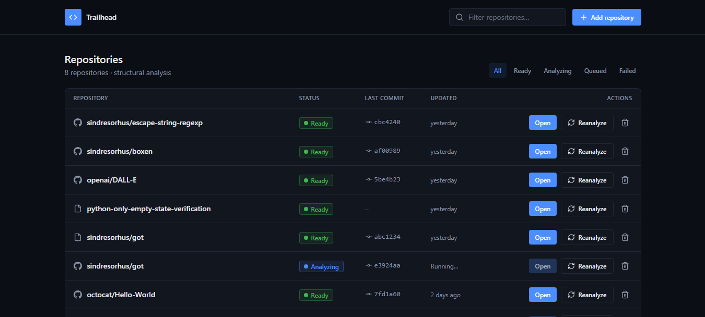
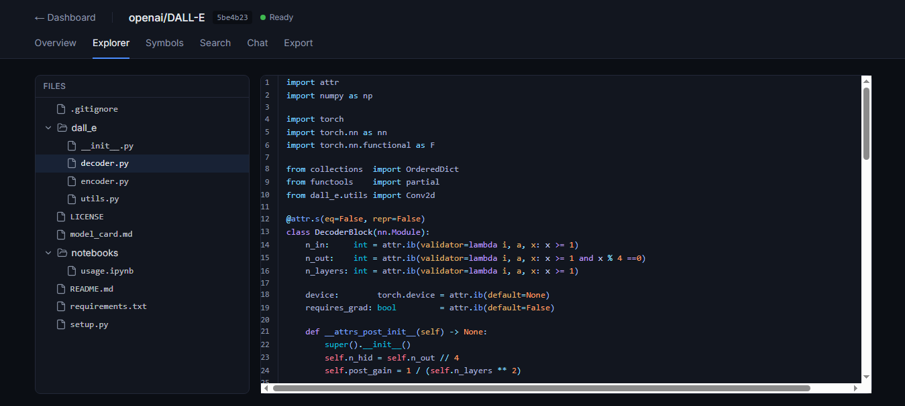
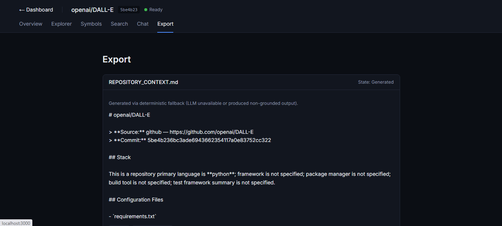
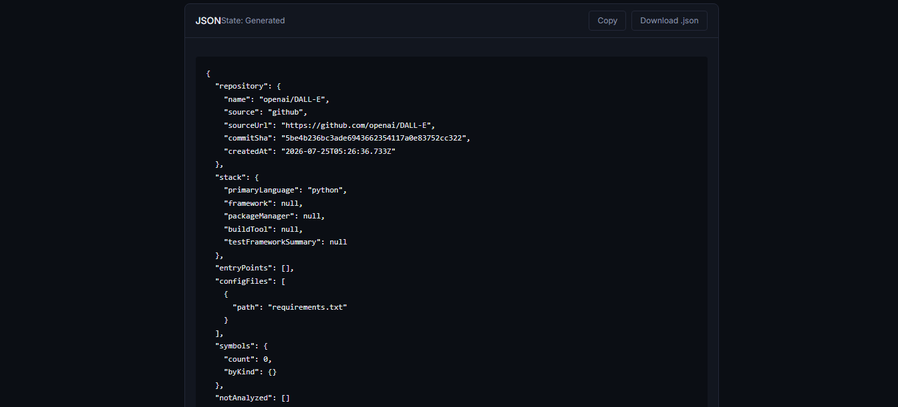
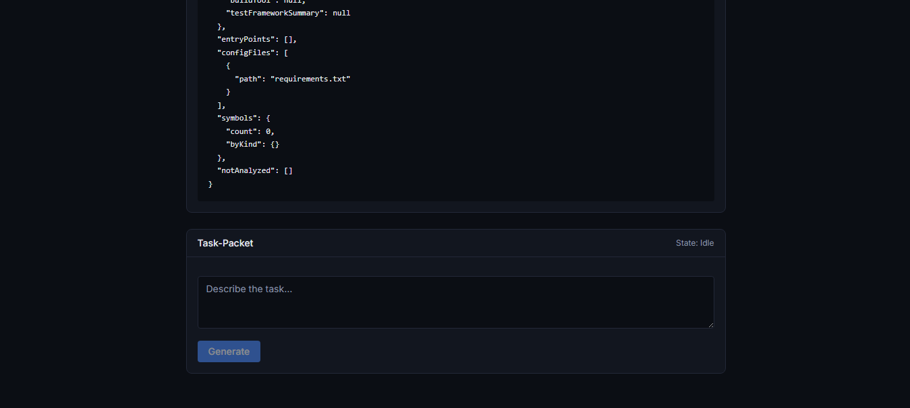

# Trailhead

Import a repository, get an evidence-grounded map of it: structural
analysis, semantic search, and a citation-backed chat interface — all
running locally, on your own machine, for zero ongoing cost.

## What it does

Point Trailhead at a public GitHub repo (or upload a ZIP), and it will:

- **Parse** the real source — extract functions, classes, interfaces,
  imports, and exports via [tree-sitter](https://tree-sitter.github.io/tree-sitter/)
- **Detect** the stack — primary language, framework, package manager,
  build tool, test framework
- **Embed** every file for semantic retrieval, entirely in-process, no
  external embedding API
- **Answer questions** about the codebase with citations that resolve
  to real file/line ranges — every claim is checked against actually-
  retrieved evidence before it's ever shown to you
- **Export** structured context (a Markdown summary, raw JSON facts,
  or a task-scoped evidence packet) for handing off to an AI coding
  agent working in the same repo

## Screens

| Screen | What it's for |
|---|---|
| **Dashboard** | Import, list, filter, delete, and reanalyze repositories |
| **Overview** | Template-generated facts — stack, entry points, config files, what wasn't analyzed |
| **Explorer** | Browse the real file tree, view syntax-highlighted source |
| **Symbols** | Browsable index of every extracted function/class/interface/import/export |
| **Search** | Exact + full-text search across the repository |
| **Chat** | Multi-turn, evidence-grounded Q&A with inline citations |
| **Export** | Repository summary, structured JSON, or task-scoped evidence — built for feeding into an AI coding agent |

## Screenshots

<p align="center">
  <br>
  <sub>Dashboard</sub>
</p>

<p align="center">
  <br>
  <sub>Explorer</sub>
</p>

<p align="center">
  <br>
  <sub>Export — REPOSITORY_CONTEXT.md</sub>
</p>

<p align="center">
  <br>
  <sub>Export — JSON</sub>
</p>

<p align="center">
  <br>
  <sub>Export — Task-Packet</sub>
</p>

## Stack

| Layer | Choice |
|---|---|
| Framework | Next.js 14 (App Router) + TypeScript |
| Database | PostgreSQL 17 + [pgvector](https://github.com/pgvector/pgvector) |
| ORM | Drizzle |
| Parsing | web-tree-sitter (WASM — no native bindings) |
| Embeddings | [transformers.js](https://huggingface.co/docs/transformers.js) (`Xenova/all-MiniLM-L6-v2`), self-hosted, in-process |
| Generation | [Groq](https://groq.com) (`llama-3.3-70b-versatile`), free tier |
| Styling | Tailwind CSS v4 |

Everything runs locally except the two external API calls (Groq for
generation, GitHub's API for cloning/metadata) — no other service
dependency, no ongoing cost beyond those two free tiers.

## Getting started

### Prerequisites

- Node.js 18.17+
- PostgreSQL 17 with the **pgvector** extension

**Installing pgvector on Windows** is the one genuinely non-trivial
step — there's no package-manager install; it needs compiling from
source with Visual Studio Build Tools. Full, real, tested steps are in
[`KNOWN-GOOD.md`](./KNOWN-GOOD.md) (search for "pgvector"). On macOS/
Linux, pgvector is typically available via your package manager or
[the project's own install instructions](https://github.com/pgvector/pgvector#installation)
— this hasn't been tested on those platforms as part of this project,
so treat that path as unverified.

### Setup

```bash
git clone git@github.com:JR-Sitraka/Trailhead.git
cd Trailhead
npm install
```

Create two local databases (one for normal use, one for the automated
test suite):

```sql
CREATE DATABASE trailhead_dev;
CREATE DATABASE trailhead_test;
```

Enable pgvector on both:

```sql
\c trailhead_dev
CREATE EXTENSION vector;
\c trailhead_test
CREATE EXTENSION vector;
```

Copy `.env.example` to `.env` and fill in:

```bash
cp .env.example .env
```

- `DATABASE_URL` / `TEST_DATABASE_URL` — your two databases above
- `GROQ_API_KEY` — free, no card required, from [console.groq.com](https://console.groq.com)
- `GITHUB_TOKEN` — optional but recommended (raises GitHub import rate
  limits from 60/hour to 5,000/hour); see `.env.example` for exact
  token permissions needed

Push the database schema and start:

```bash
npm run db:push
npm run dev
```

Open `http://localhost:3000` and import a repository.

## Known limitations

Stated plainly, not buried:

- **No authentication.** This is designed for single-operator, local
  use. Do not deploy this publicly-accessible without adding real auth
  first — anyone who can reach it can import, delete, or reanalyze any
  repository.
- **The embedding model has no code-semantic understanding.**
  `Xenova/all-MiniLM-L6-v2` is a general-purpose text model — it can
  match surface tokens (e.g. a filename mentioned in `package.json`)
  more strongly than a file's actual code content. Chat's citation
  validation prevents this from producing *wrong* answers (it will
  correctly say "no relevant evidence found" rather than hallucinate),
  but it does mean some genuinely answerable questions won't get
  answered. A code-aware candidate was evaluated against a real
  benchmark suite: it improved code-oriented retrieval but regressed
  documentation retrieval, and was held rather than adopted (ADR-009).
  Any future candidate must satisfy ADR-009's complete acceptance bar
  before it ships — see `PROJECT-STATE.md` and `RETROSPECTIVE.md`.
- **Screen-reader accessibility — audited, largely addressed.** A live,
  first-time-user NVDA audit produced seven findings: six confirmed
  defects, all fixed and independently live-reconfirmed, plus one
  reported Overview-heading defect that did not reproduce on
  investigation. VoiceOver remains untested.
  - **Chat's malformed-history rejection (CHAT-09) can only be tested
    at the API level, never through real UI interaction** — the client
    never constructs a malformed history object, so server-side
    protection is real but the UI can't exercise it. Accepted as a
    permanent limitation of black-box UI testing, not a gap awaiting
    coverage.
  - **Chat's announced answers read inline citation markers
    mechanically** — e.g. `[3] (index.d.ts:1)` is spoken as those
    literal tokens rather than as a natural pause. Functional (the
    marker's information is fully conveyed), but rougher than
    prose-integrated citations would be. Logged as a future polish
    item, not a defect.

## How this was built

This project was built end-to-end through AI-orchestrated development
— a structured, three-actor process (a planning assistant, a coding
agent, and a person making the real decisions) rather than a single
prompt-and-hope approach. If you're curious about the actual process,
real decisions made along the way, and the framework behind it:

- [`STARTER-KIT.md`](./STARTER-KIT.md) — the methodology itself
- [`PROJECT-STATE.md`](./PROJECT-STATE.md) — current status and open items
- [`KNOWN-GOOD.md`](./KNOWN-GOOD.md) — every real environment quirk and bug found during development, and how it was fixed
- [`RETROSPECTIVE.md`](./RETROSPECTIVE.md) — what worked, what didn't
- [`docs/`](./docs/) — the full product spec, architecture, and feature
  documentation this was built from
- [`roles/`](./roles/) and [`playbooks/`](./playbooks/) — the actual
  role definitions and procedures used throughout

## License

MIT — see [`LICENSE`](./LICENSE).
